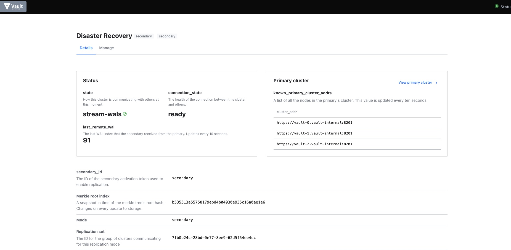

# Vault on GKE Disaster recovery replication
KB article on how to setup Vault DR replciation on GKE


>***Note: This article is just an example reference on how you can setup DR replication on vault clusters hosted on kubernetes. Please refer to links at bottom of this page for deployment best practices and reference architecture***


###How to setup Vault DR replication on GKE (Google kubernetes engine)

### Introduction

The following is an example of creating a disaster recovery cluster using Vault Helm.

For more information on Disaster Recovery, [see the official documentation](https://www.vaultproject.io/docs/enterprise/replication).

### Expected Outcome: 

By end of this KB you should have two vault clusters (primary and secondary) hosted on different Kubernetes clusters and running DR replication. 

### Prerequisites : 

* A [google cloud](https://cloud.google.com/) account with [Kubernetes engine api](https://cloud.google.com/kubernetes-engine/docs/reference/rest) enabled. 

### Use Case :

Vault can be deployed into Kubernetes using the official HashiCorp Vault Helm chart. The Helm chart allows users to deploy Vault in various configurations:

* Dev: a single in-memory Vault server for testing Vault
* Standalone (default): a single Vault server persisting to a volume using the file storage backend
* High-Availability (HA): a cluster of Vault servers that use an HA storage backend such as Consul (default)
* External: a Vault Agent Injector server that depends on an external Vault server

This KB article covers directions on how to setup two HA vault cluster with one been primary and other as DR replicated cluster to this primary.

### Procedure:

Step 1 : Create a cluster on GKE cluster on your google project and make sure all default health checks are passed


Step 2 : Install Helm on the cluster

```
## to get Helm 3
$ curl https://raw.githubusercontent.com/kubernetes/helm/master/scripts/get-helm-3 > get_helm.sh
## change access level for .sh
$ chmod 700 get_helm.sh
## this will install helm and tiller on shell
$ ./get_helm.sh
```

Step 3 : Now you are ready to install vault on this cluster. Clone official Hashicorp [vault-helm](https://github.com/hashicorp/vault-helm) repository. 

For this KB we will leave everything default except following three changes on [values.yaml](https://github.com/hashicorp/vault-helm/blob/master/values.yaml):
1. Change server images to vault enterprise for replication [here](https://github.com/hashicorp/vault-helm/blob/master/values.yaml#L217)
```
            image:
             repository: "hashicorp/vault-enterprise"
             tag: "1.7.1_ent"
             # Overrides the default Image Pull Policy
             pullPolicy: IfNotPresent
```
2. Change agent image to vault enterprise [here](https://github.com/hashicorp/vault-helm/blob/master/values.yaml#L61)

```
            agentImage:
              repository: "hashicorp/vault-enterprise"
              tag: "1.7.1_ent"
```

3. Update `serviceType` to `LoadBalancer` for UI [here](https://github.com/hashicorp/vault-helm/blob/master/values.yaml#L677) to access Vault through UI. And `service` type to `LoadBalancer` [here](https://github.com/hashicorp/vault-helm/blob/master/values.yaml#L459) the reason we do this is to expose `vault-active` service to externalIP, this will help while setting up replication later. *Refer to Notes section below for more details.*

```
## for UI
            activeVaultPodOnly: false
            serviceType: "LoadBalancer"
            serviceNodePort: null
            externalPort: 8200

## for service

            service:
                enabled: true
                type: "LoadBalancer"
```
Step 4:  Now we are all set to install vault on this cluster using helm chart. From your local terminal you can connect to GKE cluster with something like `gcloud container clusters get-credentials <cluster_name> --zone <gcp_zone_name> --project <project_name>` and run `helm install..`

```
            helm install vault -f values.yaml ./ \
            --set='server.ha.enabled=true' \
            --set='server.ha.raft.enabled=true'
```
Step 5. This should bring up a 3 vault server pods and one injector pod. Note that, your vault pods are not ready `0/1` reason is their health check is not successful and vautl needs to initialized and unsealed.
Also you would see services been deployed as loadbalance, wait for `externalIP` been assigned to these services as it might take some time.

```
❯ kubectl get pods
NAME                                     READY   STATUS    RESTARTS   AGE
vault-0                                  0/1     Running   0          36s
vault-1                                  0/1     Running   0          36s
vault-2                                  0/1     Running   0          36s
vault-agent-injector-5545c8bbbb-p2p95    1/1     Running   0          36s

❯ kubectl get services
NAME                       TYPE           CLUSTER-IP      EXTERNAL-IP     PORT(S)                         AGE
kubernetes                 ClusterIP      10.xxx.xx.x      <none>          443/TCP                         111d
vault                      LoadBalancer   10.xxx.xx.xx    xx.xx.xxx.xx    8200:30800/TCP,8201:31616/TCP   2m3s
vault-active               LoadBalancer   10.xxx.xx.xxx   xx.xxx.xxx.xx   8200:31566/TCP,8201:31207/TCP   2m3s
vault-agent-injector-svc   ClusterIP      10.xxx.xx.xxx   <none>          443/TCP                         2m3s
vault-internal             ClusterIP      None            <none>          8200/TCP,8201/TCP               2m3s
vault-standby              LoadBalancer   10.xxx.x.xxx    xx.xx.xxx.xx    8200:32630/TCP,8201:30012/TCP   2m3s
```
Step 6. Initialize and unseal vault on `vault-0` and join `vault-1` and `vault-2` to cluster.

```
❯ kubectl exec -it vault-0 -- /bin/sh

$ vault operator init -key-shares=1 -key-threshold=1
Unseal Key 1: yxxxxxxxxxxxxxxxxxxxxxxxxxxxxxx=

Initial Root Token: s.xxxxxxxxxxxxxxxxxxx

Vault initialized with 1 key shares and a key threshold of 1. Please securely
distribute the key shares printed above. When the Vault is re-sealed,
restarted, or stopped, you must supply at least 1 of these keys to unseal it
before it can start servicing requests.

Vault does not store the generated master key. Without at least 1 key to
reconstruct the master key, Vault will remain permanently sealed!

It is possible to generate new unseal keys, provided you have a quorum of
existing unseal keys shares. See "vault operator rekey" for more information.

/ $ vault operator unseal yxxxxxxxxxxxxxxxxxxxxxxxxxxxxxx=
Key                     Value
---                     -----
Seal Type               shamir
Initialized             true
Sealed                  false
Total Shares            1
Threshold               1
Version                 1.7.1+ent
Storage Type            raft
Cluster Name            vault-cluster-d8b44a41
Cluster ID              fa7731ac-c632-e9e4-b938-289141eec005
HA Enabled              true
HA Cluster              n/a
HA Mode                 standby
Active Node Address     <none>
Raft Committed Index    52
Raft Applied Index      52

## join nodes

❯ kubectl exec -ti vault-1 -- vault operator raft join http://vault-0.vault-internal:8200
Key       Value
---       -----
Joined    true

❯ kubectl exec -ti vault-2 -- vault operator raft join http://vault-0.vault-internal:8200
Key       Value
---       -----
Joined    true
```

Step 7. You now have fully functional vault cluster. Perform steps 1-6 to create another vault cluster either in same project or other as per your requirements. 

Step 8. Bring up vault UI for both primary and secondary clusters using LB addresses on your services. On your primary cluster enable DR replication and ser `primary cluster address` as your Active LB ingress address (for example above) pointing to port 8201. **This is important as this is the address your DR cluster will use to reach out to primary cluster to `bootstrap` replication.** Create a replication token, your primary UI will look something like this


Step 9. Use replication token created above on you DR cluster and set `primary_api_addr` as your Active LB ingress address pointing to port 8200. Somthing like below:


Step 10. Once setup, your DR cluster will start replication from primary cluster and you can see status of replication on your DR UI cluster



#### Note:

Sometimes when kubernetes clusters are hosted on on-prem clusters there is a limitation that on services that can be deployed as LoadBalancer or assigned an `externalIp`. For replication to bootstrap its important that your DR cluster is able to reach primary `vault-active` node and able to communicate over api and cluster ports (8200 and 8201) by default. 

For these kind of limitations, you can setup all services as default `ClusterIp` and setup a separate ingress service pointing to `vault-active` service and listening to `8200 and 8201` port. Something like this:

```
---
apiVersion: v1
kind: Service
metadata:
  name: vault-active-lb
  namespace: vault
spec:
  ports:
  - name: https
    port: 8200
    protocol: TCP
    targetPort: 8200
  - name: https-internal
    port: 8201
    protocol: TCP
    targetPort: 8201
    nodePort: 30000
  selector:
    vault-active: "true"
  sessionAffinity: None
  type: NodePort
```

If you end up using `LoadBalancer` in service your `vault-active` service will look like below. Essentially and `external-ip` address pointing to internl `vault-active` service on port `8200` and `8201`.

```
❯ kubectl describe services vault-active
Name:                     vault-active
Namespace:                default
Labels:                   app.kubernetes.io/instance=vault
                          app.kubernetes.io/managed-by=Helm
                          app.kubernetes.io/name=vault
                          helm.sh/chart=vault-0.12.0
Annotations:              cloud.google.com/neg: {"ingress":true}
                          cloud.google.com/neg-status:
                            {"network_endpoint_groups":{"8201":"k8s1-2297d871-default-vault-active-8201-bc2047f4"},"zones":["australia-southeast1-a"]}
                          meta.helm.sh/release-name: vault
                          meta.helm.sh/release-namespace: default
Selector:                 app.kubernetes.io/instance=vault,app.kubernetes.io/name=vault,component=server,vault-active=true
Type:                     LoadBalancer
IP:                       xx.xxx.xx.xxx
LoadBalancer Ingress:     xx.xx.xxx.xx
Port:                     http  8200/TCP
TargetPort:               8200/TCP
NodePort:                 http  31351/TCP
Endpoints:                10.xxx.xx.xx:8200
Port:                     https-internal  8201/TCP
TargetPort:               8201/TCP
NodePort:                 https-internal  31567/TCP
Endpoints:                10.xxx.xx.xx:8201
Session Affinity:         None
External Traffic Policy:  Cluster
Events:                   <none>
```
### Additional Information: 

* https://www.vaultproject.io/docs/platform/k8s
* https://learn.hashicorp.com/collections/vault/kubernetes
* https://learn.hashicorp.com/tutorials/vault/kubernetes-reference-architecture